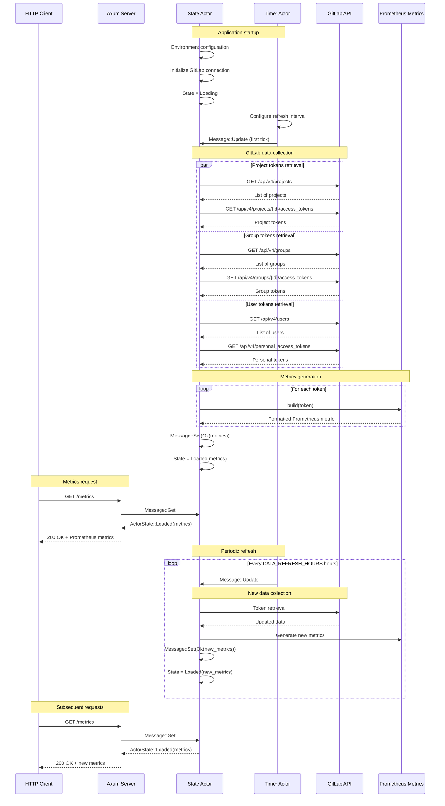

# GitLab Tokens Exporter Architecture

## Description

GitLab Tokens Exporter is a Prometheus exporter that monitors GitLab tokens (projects, groups, and users) and exposes the number of days remaining before their expiration as Prometheus metrics.

## General Architecture

The application uses an actor-based architecture with Tokio, enabling asynchronous and concurrent operation management. It exposes an HTTP server to serve metrics in Prometheus format.

## Sequence Diagram

## Main Components

### 1. Main (`main.rs`)
- Application entry point
- Initializes Axum HTTP server on port 3000
- Launches State and Timer actors
- Handles system signals (SIGTERM)

### 2. State Actor (`state_actor.rs`)
- Main actor managing application state
- Processes messages:
  - `Get`: Returns current metrics state
  - `Update`: Launches GitLab data collection
  - `Set`: Updates state with new data
- Manages configuration via environment variables
- Orchestrates parallel token collection

### 3. Timer Actor (`timer.rs`)
- Periodically sends `Update` messages to State Actor
- Configurable interval via `DATA_REFRESH_HOURS` (6h default)

### 4. HTTP Server
- Route `/`: Returns "I'm Alive :D"
- Route `/metrics`: Returns Prometheus metrics
- HTTP status code handling:
  - `204 No Content`: Data loading or no tokens found
  - `200 OK`: Metrics available
  - `500 Internal Server Error`: Collection error

### 5. GitLab Modules (`gitlab/`)
- `connection.rs`: HTTP connection management to GitLab
- `project.rs`, `group.rs`, `user.rs`: Models and API queries
- `token.rs`: Token types and access levels
- `pagination.rs`: API response pagination handling

### 6. Prometheus Metrics (`prometheus_metrics.rs`)
- Generates metrics in Prometheus format
- Calculates days remaining before expiration
- Normalizes metric names (allowed characters)
- Includes metadata: token type, scopes, access level, etc.

## Concurrency Management

The application uses several strategies to optimize performance:

1. **Type-based parallelization**: Projects, groups, and users are processed in parallel
2. **Chunk processing**: Requests are grouped according to `MAX_CONCURRENT_REQUESTS`
3. **Group caching**: Avoids redundant API requests for group hierarchy

## Application States

- `Loading`: Initial state, collection in progress
- `Loaded(String)`: Metrics available
- `NoToken`: No tokens found
- `Error(String)`: Collection error

## Metrics Format

Each token generates a Prometheus metric with:
- **Name**: `gitlab_token_{full_path}_{token_name}` (normalized characters)
- **Type**: `gauge`
- **Value**: Number of days before expiration (can be negative if expired)
- **Labels**: token type, name, status, scopes, access level, web URL
